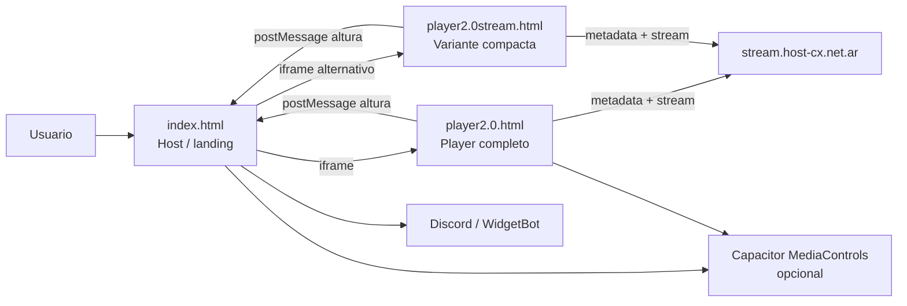

# Player3.0-webtemp

## Visión general

Este repositorio contiene la versión web del reproductor de **Konata Station**.

Es una solución estática, sin framework ni bundler, construida con **HTML + CSS + JavaScript vanilla**. Su objetivo es publicar una landing simple que combine:

- un **host** (`index.html`) con layout, logo, Discord y bridge opcional,
- un **embed principal** (`player2.0.html`) con la UI completa del player,
- una **variante compacta** (`player2.0stream.html`) pensada para uso tipo widget/card.

## Cómo está organizada la documentación

| Documento | Propósito |
|---|---|
| `README.md` | Vista general del proyecto: arranque, estructura, arquitectura, mapa de archivos y riesgos de mantenimiento. |
| `docs/README-player.md` | Referencia técnica del player: flujo interno, módulos JS/CSS, integración embed, mensajes entre host y player, bridge nativo y variantes. |

Si heredas el proyecto, empieza por este archivo y luego pasa a `docs/README-player.md`.

## Qué hace el proyecto

### Responsabilidades funcionales

1. Mostrar una landing pública con branding de Konata Station.
2. Embebir el reproductor dentro de un `iframe`.
3. Mostrar una vista de comunidad de Discord.
4. Consultar metadata del stream en tiempo real.
5. Reproducir el audio en navegador o delegarlo a un bridge nativo si existe un contenedor Capacitor.
6. Mantener variantes HTML para distintos contextos de uso.

### Arquitectura general

| Capa | Archivo principal | Responsabilidad |
|---|---|---|
| Host | `index.html` | Compone la landing, monta el `iframe`, sincroniza altura, integra Discord y actúa como puente opcional hacia `MediaControls`. |
| Embed principal | `player2.0.html` | Renderiza la UI completa del reproductor, controla `<audio>`, consulta metadata y notifica cambios de altura al host. |
| Embed compacto | `player2.0stream.html` | Reutiliza la lógica base del player, fuerza tema oscuro e intenta una experiencia más agresiva de autoplay para uso embebido/visual. |

#### Diagrama simple



## Estructura del proyecto

```text
Player3.0-webtemp/
├── index.html
├── player2.0.html
├── player2.0stream.html
├── README.md
├── CHANGELOG.md
├── LICENSE
├── package.json
├── playwright.config.js
├── css/
│   ├── index.css
│   ├── player.css
│   └── player-embed.css
├── js/
│   ├── player-core.js
│   ├── player-device.js
│   ├── player-height.js
│   ├── player-native.js
│   ├── player-ui.js
│   ├── player-audio.js
│   └── player.js
├── tests/
│   └── player-smoke.spec.js
├── docs/
│   └── README-player.md
└── assets/
    └── img/
```

## Mapa de archivos principales

### HTML

| Archivo | Rol | Qué contiene |
|---|---|---|
| `index.html` | Host | Logo, `iframe` del player, widget Discord, footer temporal, sync de altura y bridge host ↔ plugin nativo. |
| `player2.0.html` | Player completo | Portada, badge, track actual, artista expandible, play/pause, mute, volumen, historial mobile/desktop y `<audio>`. |
| `player2.0stream.html` | Player compacto | UI visual reducida, dark mode forzado, estado local forzado y varios intentos de autoplay/unlock. |

### JavaScript

| Archivo | Responsabilidad principal |
|---|---|
| `js/player-core.js` | Configuración base, estado global, referencias DOM, `localStorage` seguro y utilidades compartidas. |
| `js/player-device.js` | Heurísticas de dispositivo para decidir, por ejemplo, si conviene ocultar la UI de volumen. |
| `js/player-height.js` | Comunicación de altura embed ↔ host con `postMessage`, observers y validación de origen. |
| `js/player-native.js` | Bridge opcional hacia `window.Capacitor.Plugins.MediaControls` o fallback vía host. |
| `js/player-ui.js` | Tema, volumen, mute, render visual, historial, accesibilidad y Media Session API. |
| `js/player-audio.js` | Playback, metadata, polling, recuperación, refresh del stream y watchdog de congelamiento. |
| `js/player.js` | Bootstrap del player y cleanup en `beforeunload`. |

### CSS

| Archivo | Responsabilidad principal |
|---|---|
| `css/index.css` | Layout y responsive del host. |
| `css/player.css` | Layout, temas y responsive interno del player. |
| `css/player-embed.css` | Reset mínimo del documento embebido. |

### Soporte y pruebas

| Archivo | Rol |
|---|---|
| `package.json` | Dependencia de Playwright y script `test:smoke`. |
| `playwright.config.js` | Configuración del smoke test con servidor estático local. |
| `tests/player-smoke.spec.js` | Verificaciones básicas de render y layout. |
| `docs/README-player.md` | Referencia técnica detallada del player. |

## Arranque local

Este proyecto **NO requiere build**.

### Opción recomendada

```bash
python3 -m http.server 5501
```

Abrir luego:

```text
http://127.0.0.1:5501/index.html
```

### Por qué no conviene usar `file://`

Porque el proyecto depende de:

- `iframe`,
- `fetch` a servicios externos,
- `postMessage` entre host y embed,
- rutas relativas CSS/JS.

Abrir archivos directamente puede romper o distorsionar el comportamiento real.

## Flujo funcional resumido

1. `index.html` renderiza el host e inserta `player2.0.html` en un `iframe`.
2. El embed carga sus módulos JS en orden sobre `window.KSPlayer`.
3. `player-audio.js` consulta metadata en `https://stream.host-cx.net.ar/api/nowplaying/3`.
4. La UI actualiza track, artista, portada, badge e historial.
5. Cuando el usuario reproduce, se conecta al stream MP3 `https://stream.host-cx.net.ar/listen/konata-station-radio/radio.mp3`.
6. El player sigue haciendo polling y aplica recuperación si el stream se degrada.
7. `player-height.js` reporta altura al host para mantener el `iframe` sincronizado con el contenido real.

> El detalle técnico de este flujo vive en `docs/README-player.md`.

## Contratos importantes de arquitectura

### Orden de carga del embed

En `player2.0.html` y `player2.0stream.html` el orden actual es:

1. `player-core.js`
2. `player-device.js`
3. `player-height.js`
4. `player-native.js`
5. `player-ui.js`
6. `player-audio.js`
7. `player.js`

Ese orden IMPORTA porque los módulos comparten el namespace global `window.KSPlayer`.

### Responsive en dos niveles

| Nivel | Archivo | Qué resuelve |
|---|---|---|
| Host | `css/index.css` | Layout general, relación player/Discord, alturas mínimas y breakpoints globales. |
| Embed | `css/player.css` | Comportamiento interno de la card, historial y controles según ancho/alto disponible. |

## Dependencias externas relevantes

El funcionamiento real depende de varios servicios externos:

- **Metadata y stream**: `stream.host-cx.net.ar`
- **Fuentes e iconos**: Google Fonts y Material Icons
- **Assets de marca**: CDN jsDelivr apuntando a `ks-player-assets`
- **Imágenes remotas**: logo y portadas
- **Discord embebido**: WidgetBot / Discord

Si alguno de estos endpoints falla, el problema puede parecer local aunque no lo sea.

## Troubleshooting general

### Autoplay no arranca

Esto puede ser normal: el navegador o WebView puede bloquear `play()` sin gesto del usuario. La variante `player2.0stream.html` hace más intentos de desbloqueo, pero NO puede garantizar autoplay.

### El `iframe` no ajusta altura

Primero verifica que host y embed puedan intercambiar `postMessage` con el `origin` esperado. Si eso falla, el host depende de medición fallback y puede quedar desalineado.

### Metadata, portada o audio no coinciden con lo esperado

Antes de culpar al frontend, valida `stream.host-cx.net.ar`: el player depende de ese endpoint tanto para metadata como para el MP3 en vivo.

> Para causas probables, flujo interno y pasos concretos de diagnóstico, revisa la sección **Troubleshooting del player** en `docs/README-player.md`.

## Riesgos y puntos de mantenimiento

### Riesgos actuales

1. La medición fallback del host depende de acceso compatible a `contentDocument` del `iframe`.
2. La lógica de volumen/dispositivo sigue siendo heurística; está mejor encapsulada, pero NO puede ser perfecta en todos los WebView.
3. La integración nativa solo aplica si existe un contenedor Capacitor con `MediaControls`.
4. La cobertura automatizada actual es básica; no cubre a fondo autoplay, polling, recuperación ni bridge nativo.

### Si vas a tocar algo, empieza por aquí

| Cambio buscado | Archivo de entrada recomendado |
|---|---|
| Layout general o integración con Discord | `index.html` + `css/index.css` |
| UI del reproductor | `player2.0.html` + `css/player.css` + `js/player-ui.js` |
| Reproducción, metadata o recuperación | `js/player-audio.js` |
| Altura del embed | `js/player-height.js` + script inline de `index.html` |
| Integración Android/Capacitor | `js/player-native.js` + bridge inline de `index.html` |
| Variante compacta | `player2.0stream.html` |

## Pruebas disponibles

Instalación:

```bash
npm install
```

Ejecución:

```bash
npm run test:smoke
```

Estas pruebas validan principalmente:

- render básico de la landing,
- sincronización visual entre player y Discord,
- límites de ancho del player en tablet.

## Lectura recomendada para quien hereda el proyecto

1. `README.md`
2. `index.html`
3. `player2.0.html`
4. `js/player-core.js`
5. `js/player-ui.js`
6. `js/player-audio.js`
7. `js/player-height.js`
8. `js/player-native.js`
9. `docs/README-player.md`

## Resumen ejecutivo

El proyecto es una landing estática con un reproductor embebible y una variante compacta. El host compone la página y coordina integraciones; el embed concentra la lógica real de audio, metadata, UI y resize. Este README ahora queda como mapa general del repositorio, mientras que `docs/README-player.md` concentra el detalle técnico del player.
